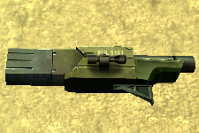
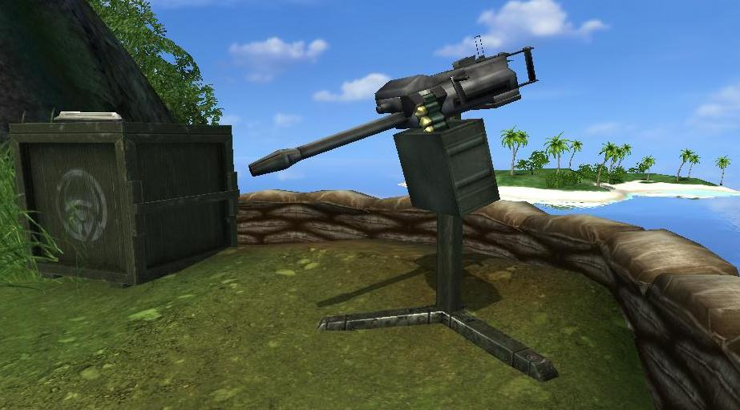
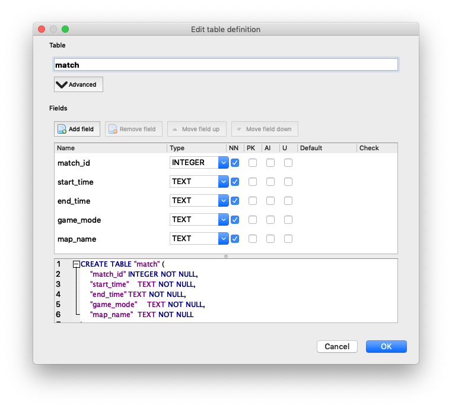
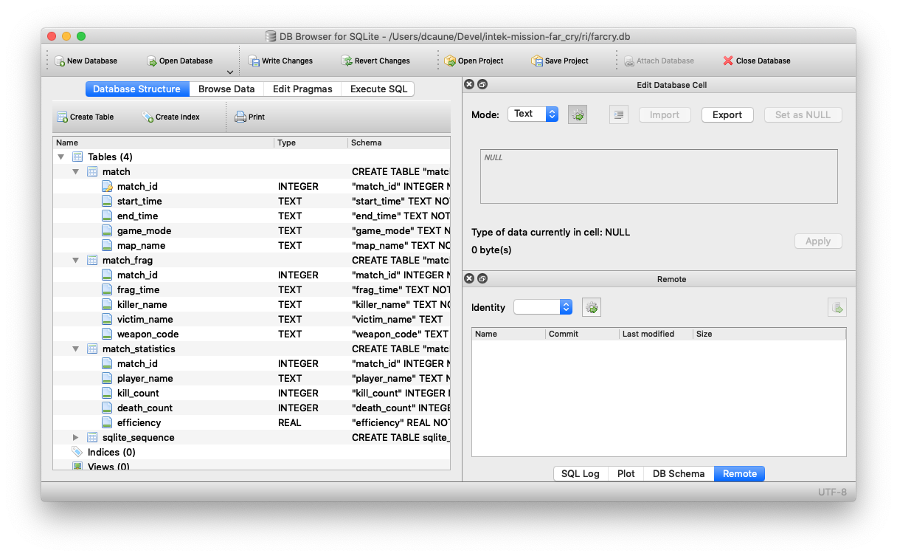
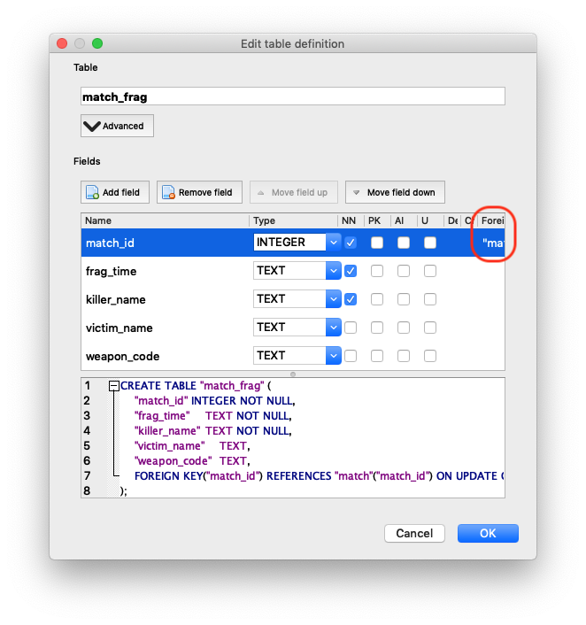
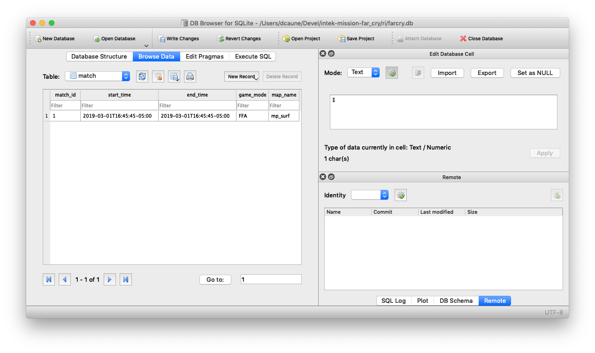
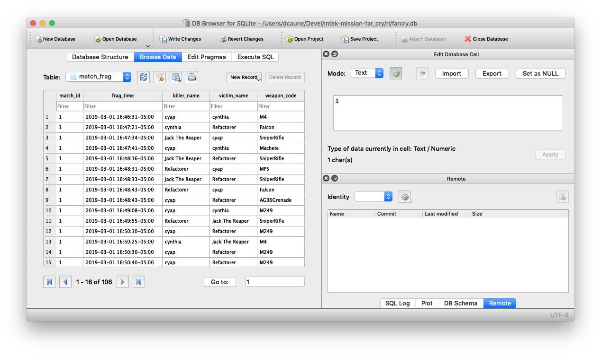
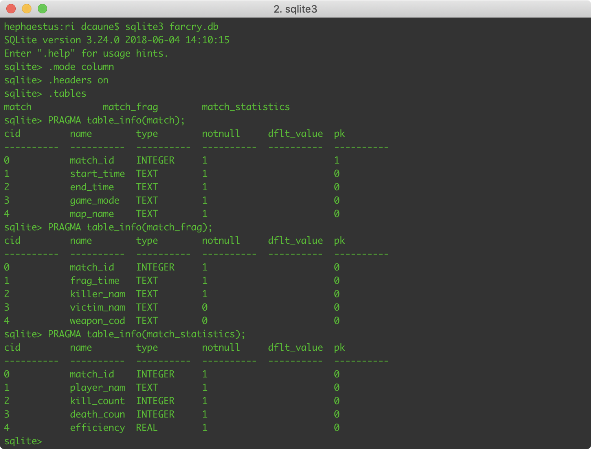

# Far Cry: Introduction to Data Science – Structured Query Language (SQL) Basics


## Introduction

[Far Cry is a first-person shooter (FPS) video game](https://www.youtube.com/watch?v=Cz3vGM08S7Q&has_verified=1) with amazing graphics, developed by Crytek and published by Ubisoft. The game was released in 2004 for Microsoft Windows and was a huge commercial success. Ubisoft closed the online servers almost 12 years later.

Far Cry features several [multiplayer modes](https://www.youtube.com/watch?v=GaFM0uWAzh0) in which players basically score points by killing other players. One of these multiplayer modes is deathmatch, also known as free for all (FFA), where the goal is to kill (or frag, from the military term) as many other players as possible within a limited period of time. Basically, everything that moves SHOULD be killed… :)

### Multiplayer FFA Session

Players can join an online multiplayer session by connecting to a Far Cry server. A session starts for a configurable limited period of time, for example: 30 minutes, during which each player tries their best to seek out and kill other players.

When the limited period of time expires, the game stops and it displays the results of the match as an ordered leaderboard with the number of kills and deaths per player, and the efficiency of each player:


### Weapons

Players have access to a large arsenal of real-world weapons in Far Cry, from grenades and pistols, to rocket launchers, machines guns and sniper rifles. Check out [all of the weapons from good old Far Cry](https://www.youtube.com/watch?v=vzNG4VlCTFM)! They sound so cool!

| Name                                              | Code                                                  | Photo                                                  |
| ------------------------------------------------- | ----------------------------------------------------- | ------------------------------------------------------ |
| Machete                                           | `Machete`                                             |                      |
| Jungle Falcon                                     | `Falcon`                                              |                |
| Jackhammer Shotgun                                | `Shotgun`                                             |           |
| P90 SMG                                           | `P90`                                                 |                      |
| MP5 SMG                                           | `MP5`                                                 |                      |
| M4 Carbine                                        | `M4`                                                  |                   |
| AG36 Assault Rifle                                | `AG36` for the rifle, `AG36Grenade` for the explosive |           |
| OICW Advanced Assault Rifle                       | `OICW` for the rifle, `OICWGrenade` for the explosive |  |
| AW50 Sniper Rifle                                 | `SniperRifle`                                         |            |
| M249 SAW MG                                       | `M249`                                                |                  |
| Rocket Launcher                                   | `Rocket`                                              |              |
| Grenade                                           | `HandGrenade`                                         |                  |
| Mk.19 Mounted Mortar Launcher Platform            | `StickyExplosive`                                     |                       |
| Patrol Boat (when a player runs over another)     | `Boat`                                                |                 |
| Humvee or Buggy (when a player runs over another) | `Vehicle`                                             |                       |
| Rocket Launcher mounted on a vehicle              | `VehicleMountedRocketMG`                              |                      |
| Mounted Minigun                                   | `VehicleMountedAutoMG`, `MG`                          |               |
| Machine Gun mounted on a vehicle                  | `VehicleMountedMG`                                    |                       |
| Rocket Launcher mounted on a vehicle              | `VehicleRocket`                                       |                      |

_Note: AG36 Assault Rifle and OICW Advanced Assault Rifle weapons have two fire modes: automatic rifle and grenade launcher._

### Server Log: Frag History

The Far Cry server stores [log information in a text file](logs/log00.txt), starting with engine and system initialization data, followed by all the frags that occurred in every match sessions.

For example:

```bash
$ cat ./logs/log00.txt | grep killed | head
<26:32> <Lua> papazark killed lamonthe with AG36
<27:07> <Lua> theprophete killed lamonthe with Rocket
<27:18> <Lua> theprophete killed lamonthe with Rocket
<27:29> <Lua> theprophete killed lamonthe with Rocket
<27:47> <Lua> theprophete killed lamonthe with Rocket
<28:10> <Lua> theprophete killed papazark with Rocket
<28:49> <Lua> theprophete killed papazark with Rocket
<29:28> <Lua> papazark killed lamonthe with AG36
<29:36> <Lua> papazark killed lamonthe with AG36
<30:07> <Lua> theprophete killed papazark with SniperRifle
```

The format of a line corresponding to a frag, when a player kills another player, is:

```text
<MM:SS:> <Lua> killer_username killed victim_username with weapon_code
```

or the following format, when a player kills himself, e.g., when a stupid player miserably dies by throwing a grenade that eventually explodes at their feet...

```text
<MM:SS:> <Lua> killer_username killed itself
```

where:

- `MM`: Zero-padded minute between 00 and 59 of the time when the frag occurred;
- `SS`: Zero-padded second between 00 and 59 of the time when the frag occurred;
- `killer_username`: Username of the player who fragged another; can only contain letters, numbers, dashes ("`-`"), periods ("`.`"), and underscores (`_`);
- `victim_username`: Username of the player who has been fragged;
- `weapon_code`: Code name of the weapon that was used to frag the other player.

_Note: The time of a frag is relative to the time the Far Cry engine started. It represents the number of minutes/seconds elapsed between the moment the game engine started and when the frags occurred._

_Note: Players who joined a match but who hid during all the match, meaning they didn't kill anyone and they haven't been killed by anyone, don't appear in the frag history at all. We just ignore them._

You can download [Far Cry 1.34 on Windows](https://drive.google.com/file/d/1pQ5RFuQ3t669KXd_jV-2KoOONdT6NcY8/view?usp=sharing), [unzip](https://www.7-zip.org/) the archive on the disk of your computer, and run the executable `./Bin32/FarCry.exe`.


## Waypoint 1: Create SQLite Database and Table Match

SQLite is an RDBMS contained in a C programming library. In contrast to many other database management systems, SQLite is not a client–server database engine. The SQLite engine has no standalone processes with which an application program communicates. Instead, the SQLite library is linked in and thus becomes an integral part of an application program.

SQLite stores the entire database as a single cross-platform file on the machine the application program runs (laptop/desktop, tablet, smartphone). That means you can directly edit this file to add objects, relationships, etc.

Which application program could we use to edit an SQLite database file? There is the de facto [simple command-line inteface (CLI) program named `sqlite3`](https://sqlite.org/cli.html) that allows the user to manually enter and execute SQL statements against an SQLite database. We will see this tool later in this mission.

For now, we are going to use a more visual tool. It will be a lot easier to start with. There are many of them. We chose [DB Browser for SQLite (DB4S)](https://sqlitebrowser.org/): it is an open source tool to create, design, and edit database files compatible with SQLite.

Run this tool and create a new database `farcry`. Then create a table `match` and add the few columns corresponding to the attribute of the entity `match` in our logical data model.

[SQLite does not have a storage class set aside for storing dates and/or times](https://www.sqlite.org/datatype3.html#date_and_time_datatype). We are using the data type `TEXT` for storing date and time as [ISO 8601](https://en.wikipedia.org/wiki/ISO_8601) strings. SQLite supports built-in [date and time functions](https://www.sqlite.org/lang_datefunc.html) to manipulate ISO 8601 strings.



The DB Browser for the SQLite program application automatically generates the [DDL (Data Definition Language)](https://en.wikipedia.org/wiki/Data_definition_language) statement [`CREATE TABLE`](https://www.sqlite.org/lang_createtable.html), which is displayed below the list of columns, to create the table `match` in the SQLite database, when you click on the `OK` button.

## Waypoint 2: Define Table Match Identity Column

As we said previously, we need a unique identifier to represent each game session, such as a unique number.

But Far Cry engine's logs don't provide a unique number that references each game session. For such a situation, the simplest solution is to use an [auto-increment](https://www.w3schools.com/sql/sql_autoincrement.asp) column. It automatically generates a unique number when a new record is inserted into the table. We also call such a column an [identity column](https://en.wikipedia.org/wiki/Identity_column).

Modify the table `match` to indicate that the column `match_id` is an auto-increment, a primary key, and that it is unique.

## Waypoint 3: Create Tables Match Frag and Match Statistics

Create the tables `match_frag` and `match_statistics` with their corresponding columns:



## Waypoint 4: Create Primary and Foreign Keys

The tables `match_frag` and `match_statistics` have to be linked to the table `match` with their common column being `match_id`.

The column `match_id` of table `match` is called a primary key. The column `match_id` of the table `match_frag` and `match_statistics` is called the [foreign key](https://www.essentialsql.com/what-is-the-difference-between-a-primary-key-and-a-foreign-key/). [Primary and foreign keys](https://www.youtube.com/watch?v=-CuY5ADwn24) are used to define relationships between tables and to enforce the [referential integrity](https://en.wikipedia.org/wiki/Referential_integrity) constraint. This relationship ensures that a frag cannot be stored in the table `match_frag` with a match identifer that does not exist in the table `match`. This prevents [orphaned records](https://database.guide/what-is-an-orphaned-record/).

Modify tables `match_frag` and `match_statistics` to add [foreign key constraints](https://www.sqlite.org/foreignkeys.html) that reference the table `match`.

We would like to ensure the following [actions](https://www.sqlite.org/foreignkeys.html#fk_actions):

- If the identifier of a match (record) is updated in the parent table `match`, then this change must be propagated to the child tables `match_frag` and `match_statistics`;
- A match cannot be deleted from the parent table `match` if there are frags linked to this match.



## Waypoint 5: Insert Game Session Data into SQLite

Write a function `insert_match_to_sqlite` that takes the following arguments:

- `file_pathname`: The path and name of the Far Cry's SQLite database;
- `start_time`: a `datetime.datetime` object with time zone information corresponding to the start of the game session.
- `end_time`: A `datetime.datetime` object with time zone information corresponding to the end of the game session.
- `game_mode`: Multiplayer mode of the game session:
  - `ASSAULT`: There are two teams, one is defending a flag and the other
    team is attacking it. Each maps has 3 flags and if after 20 minutes
    not all flags are captured, the teams switch sides. The flags are in fixed
    positions on the map and only one flag at the time is active;
  - `TDM` (Team DeathMatch): There are two teams. Players of one team kill
    members of the other team;
  - `FFA` (Free-For-All): players kill anyone they can find.
- `map_name`: Name of the map that was played.
- `frags`: A list of tuples of the following form:

      (frag_time, killer_name[, victim_name, weapon_code])

  where:

  - `frag_time` (required): `datetime.datetime` with time zone when the frag occurred;
  - `killer_name` (required): username of the player who fragged another or killed himself;
  - `victim_name` (optional): username of the player who has been fragged;
  - `weapon_code` (optional): code of the weapon that was used to frag.

The function `insert_match_to_sqlite` [inserts](https://www.sqlite.org/lang_insert.html) a new record into the table `match` with the arguments `start_time`, `end_time`, `game_mode`, and `map_name`, using [an `INSERT` statement](https://www.youtube.com/watch?v=UrbItNGZU48). You need to use the Python module [`sqlite3`](https://docs.python.org/3.7/library/sqlite3.html).

The function `insert_match_to_sqlite` returns the identifier of the match that has been inserted. This information is retrieved from the SQLite database using the method [`lastrowid`](https://docs.python.org/3.7/library/sqlite3.html?highlight=lastrowid#sqlite3.Cursor.lastrowid).

```python
>>> log_data = read_log_file('./logs/log01.txt')
>>> log_start_time = parse_log_start_time(log_data)
>>> game_mode, map_name = parse_match_game_mode_and_map_name(log_data)
>>> frags = parse_frags(log_data)
>>> start_time, end_time = parse_match_start_and_end_times(log_data, log_start_time, frags)
>>> insert_match_to_sqlite('./farcry.db', start_time, end_time, game_mode, map_name, frags)
1
```



**WARNING**: You might find that your current implementation of the function `insert_match_to_sqlite` doesn't actually persist the data you have inserted into the database, while everything seems perfect, no error is raised. This is related to [transaction](http://db4beginners.com/blog/relationaldb-transaction/), one of the most fundamental concepts of relational database. Without going into details, a [transaction](https://en.wikipedia.org/wiki/Database_transaction) is used to execute several SQL statements and to commit or rollback all the changes made by these statements during this transaction: either the transaction succeeds and all updates take effect, otherwise, all the changes are cancelled.

By default, when the Python module `sqlite3` opens a connection to a database, it [starts a transaction](https://docs.python.org/3.7/library/sqlite3.html#sqlite3-controlling-transactions). You need to [commit](https://docs.python.org/3.7/library/sqlite3.html#sqlite3.Connection.commit) the implicit transaction, before closing the connection, to make permanent all changes performed in this transaction, otherwise all your changes are automatically rolled back.

You can use another technique that enables you to autocommit your changes with the connection to a database that is closed: you can wrap all the statements with a [context manager](https://docs.python.org/3.7/library/sqlite3.html#using-the-connection-as-a-context-manager). In the event of an exception, the transaction is rolled back; otherwise, the transaction is committed.

## Waypoint 6: Insert Match Frags into SQLite

Write a function `insert_frags_to_sqlite` that takes the following arguments:

- `connection`: a `sqlite3` `Connection` object;
- `match_id`; the identifier of a match;
- `frags`: a list of frags, as passed to the function `insert_match_to_sqlite`, that occurred during this match.

The function `insert_frags_to_sqlite` [inserts new records](https://docs.python.org/3.7/library/sqlite3.html#sqlite3.Cursor.executemany) into the table `match_frag`.

Integrate this function in the function `insert_match_to_sqlite`.



---


We are going to use the [Data Manipulation Language (DML)](https://en.wikipedia.org/wiki/Data_manipulation_language), a sublanguage of SQL, to calculate some statistics about game sessions.

We are not going to use any visual tools for this, but the [simple command-line inteface (CLI) program named sqlite3](https://sqlite.org/cli.html). We are nerds, aren't we ... ?



You can change [SQLite's output format](https://sqlite.org/cli.html#changing_output_formats) with the commands `.column` and `.header`.

```shell
$ sqlite3 farcry.db
SQLite version 3.24.0 2018-06-04 14:10:15
Enter ".help" for usage hints.
sqlite> .mode column
sqlite> .header on
```

## Waypoint 7: Select Start and End Times of Matches

Write a SQL query, using the simplest form of the statement [SELECT](https://www.sqlite.org/lang_select.html), that returns the columns `match_id`, `start_time`, and `end_time` of every match.

For example:

```sql
match_id    start_time                 end_time
----------  -------------------------  -------------------------
1           2018-11-09T12:25:18-05:00  2018-11-09T12:25:18-05:00
2           2018-11-09T12:25:18-05:00  2018-11-09T12:25:18-05:00
3           2019-03-01T16:45:45-05:00  2019-03-01T16:45:45-05:00
4           2019-03-11T12:38:37-05:00  2019-03-11T12:38:37-05:00
5           2019-03-12T12:37:24-05:00  2019-03-12T12:37:24-05:00
6           2019-04-02T13:19:17+00:00  2019-04-02T13:19:17+00:00
7           2019-04-04T04:46:42+00:00  2019-04-04T04:46:42+00:00
```

## Waypoint 8: Select Game Mode and Map Name of Matches

Write a SQL query that returns the identification, the game mode, and the map name of every match.

For example:

```sql
match_id    game_mode   map_name
----------  ----------  ----------
1           FFA         mp_surf
2           FFA         mp_surf
3           FFA         mp_surf
4           FFA         mp_surf
5           FFA         mp_surf
6           FFA         mp_surf
7           FFA         mp_surf
```

## Waypoint 9: Select all Columns of Matches

Write a SQL query that returns all the columns of every match without specifying each individual column, using the asterisk `*` operator.

For example:

```sql
match_id    start_time                 end_time                   game_mode   map_name
----------  -------------------------  -------------------------  ----------  ----------
1           2018-11-09T12:25:18-05:00  2018-11-09T12:25:18-05:00  FFA         mp_surf
2           2018-11-09T12:25:18-05:00  2018-11-09T12:25:18-05:00  FFA         mp_surf
3           2019-03-01T16:45:45-05:00  2019-03-01T16:45:45-05:00  FFA         mp_surf
4           2019-03-11T12:38:37-05:00  2019-03-11T12:38:37-05:00  FFA         mp_surf
5           2019-03-12T12:37:24-05:00  2019-03-12T12:37:24-05:00  FFA         mp_surf
6           2019-04-02T13:19:17+00:00  2019-04-02T13:19:17+00:00  FFA         mp_surf
7           2019-04-04T04:46:42+00:00  2019-04-04T04:46:42+00:00  FFA         mp_surf
```

_Note: Using the asterisk `*` operator is only convenient for querying data interactively through an SQL client application. However, if you use the asterisk `*` operator in embedded statements in your application, you may have [some potential problems](https://use-the-index-luke.com/blog/2013-08/its-not-about-the-star-stupid)._

## Waypoint 10: Select distinct Killer Names

Write a SQL query that returns the [distinct](https://www.w3schools.com/sql/sql_distinct.asp) names of players who have killed another player during one or more matches.

For example:

```sql
killer_name
-----------
papazark
theprophete
lamonthe
cyap
cynthia
Jack The Re
Refactorer
Scrap
Mike Killah
CLAVEL
fluffy
Reaper
lythanhphu
Transporter
shogun
Vasily Zayt
```

## Waypoint 11: Order the List of Killer Names

Write the same SQL query as the previous waypoint, but [order](https://en.wikipedia.org/wiki/Order_by) killer names in alphabetical order.

For example:

```sql
killer_name
-----------
CLAVEL
Jack The Re
Mike Killah
Reaper
Refactorer
Scrap
Transporter
Vasily Zayt
cyap
cynthia
fluffy
lamonthe
lythanhphu
papazark
shogun
theprophete
```

## Waypoint 12: Calculate the Number of Matches

Write a SQL query that returns the [total number](http://www.sqltutorial.org/sql-aggregate-functions/sql-count/) of matches.

For example:

```
COUNT(*)
----------
7
```

## Waypoint 13: Calculate the number of Kills and Suicides

Write a SQL query that returns the total number of kills and suicides. [Alias](<https://en.wikipedia.org/wiki/Alias_(SQL)>) the returned value with the name `kill_suicide_count`.

For example:

```sql
kill_suicide_count
------------------
855
```

## Waypoint 14: Calculate the Number of Suicides

Write a SQL query that returns the total number of suicides. [Only count](<https://en.wikipedia.org/wiki/Where_(SQL)>) frags that have no victim, meaning that `victim_name` is `NULL`. Alias the returned value with the name `suicide_count`.

For example:

```sql
suicide_count
-------------
20
```

## Waypoint 15: Calculate the Number of Kills (1)

Write a SQL query that returns the total number of kills. Only count frags that have a victim, e.g., where `victim_name` is not `NULL`. Alias the returned value with the name `kill_count`.

For example:

```sql
kill_count
----------
835
```

## Waypoint 16: Calculate the Number of Kills (2)

Modify the SQL query of the previous waypoint to return the exact same result ... without using the filter clause! Only [the aggregate function `COUNT`](https://www.sqlite.org/lang_aggfunc.html).

For example:

```sql
kill_count
----------
835
```

## Waypoint 17: Calculate the Number of Kills and Suicides per Match

Write a SQL query that returns the number of kills and suicides per match using the clause [`GROUP BY`](https://www.w3resource.com/sql/aggregate-functions/count-with-group-by.php).

For example:

```sql
match_id    kill_suicide_count
----------  ------------------
8           106
9           243
10          267
11          64
12          69
13          180
14          213
```

## Waypoint 18: Calculate and Order the Number of Kills and Suicides per Match

Update the SQL query from the previous waypoint to sort the result by descending order of the number of kills.

For example:

```sql
match_id    kill_suicide_count
----------  ------------------
10          267
9           243
14          213
13          180
8           106
12          69
11          64
```

## Waypoint 19: Calculate and Order the Number of Suicides per Match

Write a SQL query that returns the number of suicides per match. Sort the result in ascending order by the number of suicides.

For example:

```sql
match_id    suicide_count
----------  -------------
12          1
8           2
13          2
11          3
9           6
10          6
14          6
```

## Waypoint 20: Calculate and Order the Total Number of Kills per Player

Write a SQL query that returns the total number of kills per player among all the game sessions they have participated in. Sort the result in descending order by the number of kills. If two players have the same total number of kills, they must be sorted by their ascending alphabetical order.

For example:

```sql
player_name  kill_count
-----------  ----------
lythanhphu   334
cyap         122
Mike Killah  106
Refactorer   84
Scrap        75
papazark     58
shogun       57
Transporter  49
lamonthe     48
cynthia      36
fluffy       32
Kadamas      20
CLAVEL       17
Reaper       15
moomoo       10
Jack The Re  9
Midora       9
hello        8
jason        8
Sentinel     7
Vasily Zayt  5
Midpra       4
nthanhvy     3
```

## Waypoint 21: Calculate and Order the Number of Kills per Player and per Match

Write a SQL query that returns the number of kills per player and per match. Sort the result by ascending identification number of match, and then by the descending number of kills for each match.

```sql
match_id    player_name  kill_count
----------  -----------  ----------
8           Refactorer   47
8           cyap         41
8           Jack The Re  9
8           cynthia      7
9           Mike Killah  54
9           papazark     50
9           cyap         46
9           Scrap        38
9           CLAVEL       17
9           cynthia      16
9           lamonthe     16
10          Mike Killah  52
10          Refactorer   37
10          Scrap        37
10          cyap         35
10          fluffy       32
10          lamonthe     32
10          Reaper       15
10          cynthia      13
10          papazark     8
11          lythanhphu   39
11          shogun       13
11          Transporter  9
12          lythanhphu   51
12          shogun       12
12          Vasily Zayt  5
13          lythanhphu   101
13          Kadamas      20
13          Transporter  15
13          shogun       11
13          Midora       9
13          hello        8
13          Sentinel     7
13          Midpra       4
13          nthanhvy     3
14          lythanhphu   143
14          Transporter  25
14          shogun       21
14          moomoo       10
14          jason        8
```

## Waypoint 22: Calculate and Order the Number of Deaths per Player and per Match

Write a SQL query that returns the number of deaths (player that has been killed by another) per player and per match. Sort the result by ascending identification number of match, and then by the descending number of deaths for each match.

```sql
match_id    player_name  death_count
----------  -----------  -----------
8           cynthia      37
8           Jack The Re  29
8           Refactorer   20
8           cyap         18
9           Scrap        48
9           CLAVEL       40
9           cynthia      37
9           lamonthe     33
9           Mike Killah  31
9           papazark     27
9           cyap         21
10          Scrap        44
10          fluffy       38
10          Mike Killah  37
10          Refactorer   33
10          Reaper       32
10          cynthia      24
10          lamonthe     22
10          cyap         19
10          papazark     12
11          Transporter  30
11          shogun       18
11          lythanhphu   10
11          papazark     3
12          Vasily Zayt  35
12          shogun       27
12          lythanhphu   6
13          lythanhphu   53
13          Transporter  22
13          Sentinel     19
13          nthanhvy     18
13          hello        16
13          shogun       16
13          Midora       14
13          Kadamas      11
13          Midpra       9
14          lythanhphu   55
14          moomoo       46
14          Transporter  41
14          shogun       36
14          jason        29
```

## Waypoint 23: Select Matches and Calculate the Number of Players and the Number of Kills and Suicides

Write a SQL query that returns all the matches that have been played, with the start time and end time of each match, the number of players per match, and the number of kills and suicides per match.

You will need to [join](http://www.sqlitetutorial.net/sqlite-inner-join/) the tables `match` and `match_frag`.

Sort the result in ascending order by start date and time of these matches.

For example:

```sql
match_id    start_time                 end_time                   player_count  kill_suicide_count
----------  -------------------------  -------------------------  ------------  ------------------
8           2019-03-01T16:45:45-05:00  2019-03-01T16:45:45-05:00  4             106
9           2019-03-11T12:38:37-05:00  2019-03-11T12:38:37-05:00  7             243
10          2019-03-12T12:37:24-05:00  2019-03-12T12:37:24-05:00  9             267
11          2019-04-02T13:19:17+00:00  2019-04-02T13:19:17+00:00  4             64
12          2019-04-04T04:46:42+00:00  2019-04-04T04:46:42+00:00  3             69
13          2019-04-11T06:41:26+00:00  2019-04-11T06:41:26+00:00  9             180
14          2019-04-12T05:13:29+00:00  2019-04-12T05:13:29+00:00  5             213
```

## Waypoint 24: Calculate Players Efficiency per Match

Write a SQL query that calculates player efficency per match. The result needs to look like the following:

```sql
match_id    player_name  kill_count  death_count  suicide_count  efficiency
----------  -----------  ----------  -----------  -------------  ----------
12          lythanhphu   51          6            0              89.47
12          shogun       12          27           1              30.0
12          Vasily Zayt  5           35           0              12.5
13          lythanhphu   101         53           0              65.58
13          Kadamas      20          11           0              64.52
13          shogun       11          16           0              40.74
13          Transporter  15          22           0              40.54
13          Midora       9           14           0              39.13
13          hello        8           16           0              33.33
13          Midpra       4           9            1              28.57
13          Sentinel     7           19           0              26.92
13          nthanhvy     3           18           1              13.64
14          lythanhphu   143         55           3              71.14
14          Transporter  25          41           0              37.88
14          shogun       21          36           1              36.21
14          jason        8           29           0              21.62
14          moomoo       10          46           2              17.24
```

Reminder: The efficiency of the player is determined by using the following formula `kills / (kills + deaths + suicides)`.

[SQLite doesn't support a few SQL standard features](https://www.sqlite.org/omitted.html) that could have been used for this waypoint.

### Calculate the Number of Kills and the Number of Suicides per Player and Per Match

Write a SQL query (`SQL-01`) that calculates the number of times a player P1 has killed another player or commited suicide. SQL returns the data per player and per match. Add to the result the following value `death_count` which contains the value `0` for each row. The result is returned in no particular order.

For example:

```sql
match_id    player_name      kill_count  suicide_count  death_count
----------  ---------------  ----------  -------------  -----------
12          Vasily Zaytsev   5           0              0
12          lythanhphu       51          0              0
12          shogun           12          1              0
13          Kadamas          20          0              0
13          Midora           9           0              0
13          Midpra           4           1              0
13          Sentinel         7           0              0
13          Transporter      15          0              0
13          hello            8           0              0
13          lythanhphu       101         0              0
13          nthanhvy         3           1              0
13          shogun           11          0              0
14          Transporter      25          0              0
14          jason            8           0              0
14          lythanhphu       143         3              0
14          moomoo           10          2              0
14          shogun           21          1              0
```

### Calculate the Number of Deaths per Player and Per Match

Write a SQL query (`SQL-02`) that calculates the number of times a player has been killed by another and returns the data per player and per match. Add to the result the following values `kill_count` and `suicide_count` with the value `0` for each row.

For example:

```sql
match_id    player_name      kill_count  suicide_count  death_count
----------  ---------------  ----------  -------------  -----------
12          Vasily Zaytsev   0           0              35
12          lythanhphu       0           0              6
12          shogun           0           0              27
13          Kadamas          0           0              11
13          Midora           0           0              14
13          Midpra           0           0              9
13          Sentinel         0           0              19
13          Transporter      0           0              22
13          hello            0           0              16
13          lythanhphu       0           0              53
13          nthanhvy         0           0              18
13          shogun           0           0              16
14          Transporter      0           0              41
14          jason            0           0              29
14          lythanhphu       0           0              55
14          moomoo           0           0              46
14          shogun           0           0              36
```

### Connect the SQL queries `SQL-01` and `SQL-02` together

Write a SQL query (`SQL-03`) that connects the SQL queries `SQL-01` and `SQL-02` together to form [a compound `SELECT` using `UNION`](http://www.sqlitetutorial.net/sqlite-union/).

For example:

```sql
match_id    player_name      kill_count  suicide_count  death_count
----------  ---------------  ----------  -------------  -----------
12          Vasily Zaytsev   0           0              35
12          Vasily Zaytsev   5           0              0
12          lythanhphu       0           0              6
12          lythanhphu       51          0              0
12          shogun           0           0              27
12          shogun           12          1              0
13          Kadamas          0           0              11
13          Kadamas          20          0              0
13          Midora           0           0              14
13          Midora           9           0              0
13          Midpra           0           0              9
13          Midpra           4           1              0
13          Sentinel         0           0              19
13          Sentinel         7           0              0
13          Transporter      0           0              22
13          Transporter      15          0              0
13          hello            0           0              16
13          hello            8           0              0
13          lythanhphu       0           0              53
13          lythanhphu       101         0              0
13          nthanhvy         0           0              18
13          nthanhvy         3           1              0
13          shogun           0           0              16
13          shogun           11          0              0
14          Transporter      0           0              41
14          Transporter      25          0              0
14          jason            0           0              29
14          jason            8           0              0
14          lythanhphu       0           0              55
14          lythanhphu       143         3              0
14          moomoo           0           0              46
14          moomoo           10          2              0
14          shogun           0           0              36
14          shogun           21          1              0
```

### Calculate the Number of Kills, Deaths, and Suicides per Player and per Match

Write a SQL query (`SQL-04`) that aggregates the result [from the SQL subquery](https://www.essentialsql.com/get-ready-to-learn-sql-server-22-using-subqueries-in-the-from-clause/) `SQL-03` (AKA the _derived table_) to return the number of kills, deaths, and suicides per player and per match.

_Note: A derived table is a subquery that can take the place of a table in the `FROM` clause of a SQL statement._

For example:

```sql
match_id    player_name      kill_count  death_count  suicide_count
----------  ---------------  ----------  -----------  -------------
12          Vasily Zaytsev   5           35           0
12          lythanhphu       51          6            0
12          shogun           12          27           1
13          Kadamas          20          11           0
13          Midora           9           14           0
13          Midpra           4           9            1
13          Sentinel         7           19           0
13          Transporter      15          22           0
13          hello            8           16           0
13          lythanhphu       101         53           0
13          nthanhvy         3           18           1
13          shogun           11          16           0
14          Transporter      25          41           0
14          jason            8           29           0
14          lythanhphu       143         55           3
14          moomoo           10          46           2
14          shogun           21          36           1
```

### Calculate the Efficiency per Player and per Match

Write a SQL query (`SQL-05`) that caculates player efficiency using the result from the SQL subquery `SQL-04` (the _derived table_). Sort the result by ascending order of match identification, and then by descending player efficiency.

For example:

```sql
match_id    player_name  kill_count  death_count  suicide_count  efficiency
----------  -----------  ----------  -----------  -------------  ----------
12          lythanhphu   51          6            0              89.47
12          shogun       12          27           1              30.0
12          Vasily Zayt  5           35           0              12.5
13          lythanhphu   101         53           0              65.58
13          Kadamas      20          11           0              64.52
13          shogun       11          16           0              40.74
13          Transporter  15          22           0              40.54
13          Midora       9           14           0              39.13
13          hello        8           16           0              33.33
13          Midpra       4           9            1              28.57
13          Sentinel     7           19           0              26.92
13          nthanhvy     3           18           1              13.64
14          lythanhphu   143         55           3              71.14
14          Transporter  25          41           0              37.88
14          shogun       21          36           1              36.21
14          jason        8           29           0              21.62
14          moomoo       10          46           2              17.24
```

## Waypoint 25: Create Players Match Efficiency View

We have previously designed the logical data model of our Far Cry system information with the entity `match_statistics`. We have created the corresponding table `match_statistics`.

However, this data model requires us to calculate and insert statistics into the table `match_statistics` each time the data of a match has been imported into both tables `match` and `match_frag`.

[Delete the table](https://sqlite.org/lang_droptable.html) `match_statistics` and [create a view](https://www.sqlite.org/lang_createview.html) with the same name `match_statistics` that returns the result of the previous waypoint.

You can query this view like a table.

For example:

```sql
sqlite> SELECT * FROM match_statistics WHERE match_id = 13 ORDER BY efficiency ASC;
match_id    player_name  kill_count  death_count  suicide_count  efficiency
----------  -----------  ----------  -----------  -------------  ----------
13          nthanhvy     3           18           1              13.64
13          Sentinel     7           19           0              26.92
13          Midpra       4           9            1              28.57
13          hello        8           16           0              33.33
13          Midora       9           14           0              39.13
13          Transporter  15          22           0              40.54
13          shogun       11          16           0              40.74
13          Kadamas      20          11           0              64.52
13          lythanhphu   101         53           0              65.58
```

**WARNING**: There is a performance issue. A view is just a pre-packaged `SELECT` statement. Which means that all of this statement will be executed before applying any filter that would have added to your request that uses the view:

```sql
SELECT *
  FROM match_statistics
  WHERE match_id = 13
  ORDER BY efficiency ASC;
```

If your tables `match` and `match_frag` have hundreds of thousands of records, even if you were only interested in player efficiency for the particular match `13`, the previous query would calculate player efficency for **every** match, before returning player efficiency for match `13`. This would be a huge waste of CPU and memory consumption!

You might want to persist these results instead of calculating them again and again. For that we would need to use a [materialized view](https://en.wikipedia.org/wiki/Materialized_view).

SQLite doesn't support materialized views. Let's move to [PostgreSQL](https://www.postgresql.org/), the ultimate relational database management system that allows you to create complex applications which work flawlessly even for a large number of users.
